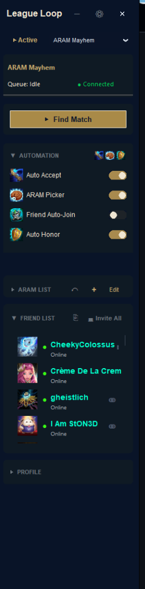
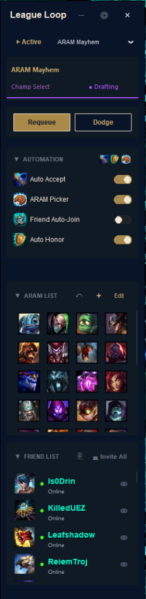
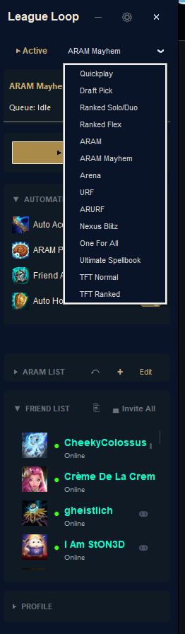

  
  <h1>LeagueLoop — Installer</h1>
  
<em>One-click setup for the ultimate League of Legends automation companion.</em>

   

  <a href="LeagueLoop_Installer.exe"><strong>⬇ Download LeagueLoop_Installer.exe</strong></a>

    

  

---

## Screenshots

  <table>
    <tr>
      <td align="center"> Lobby — Idle</td>
      <td align="center"> Connected &amp; Ready</td>
    </tr>
    <tr>
      <td align="center"> Champ Select — Live Drafting</td>
      <td align="center"> Queue Mode Selector</td>
    </tr>
  </table>

---

## Quick Start

1. Download **`LeagueLoop_Installer.exe`** from this repository.
2. Run the installer — it will place LeagueLoop into `C:\Program Files\LeagueLoop`.
3. Launch **LeagueLoop** and let it dock to your League Client automatically.

## What is LeagueLoop?

LeagueLoop is an autonomous overlay companion for League of Legends that automates repetitive lobby workflows so you can focus on the game:

- **Auto-Accept** — Never miss a queue pop
- **Priority Sniper** — Instantly lock your top ARAM champions
- **Auto-Honor** — Smart post-game honor targeting
- **Compact Orb Mode** — Shrinks to a draggable glowing orb during games
- **Omnibar** (`Ctrl+K`) — Command palette for rapid queue switching and client control

## Requirements

- Windows 10 / 11
- League of Legends (Riot Client installed)

## Disclaimer

> LeagueLoop was created under Riot Games' policy using assets owned by Riot Games.
> Riot Games does not endorse or sponsor this project.
> Use entirely at your own risk.

---

  Made by Malcolm

