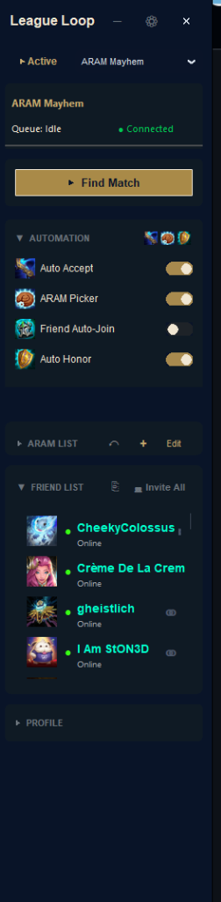
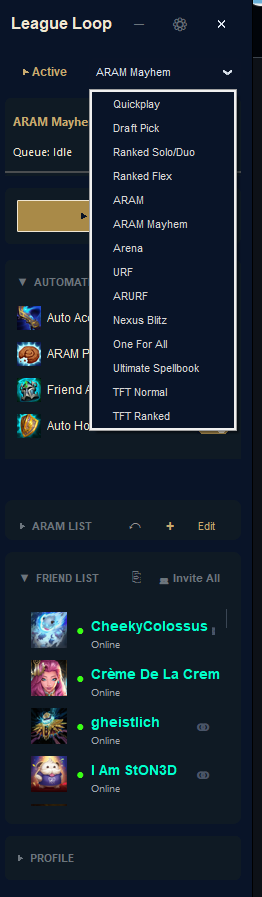
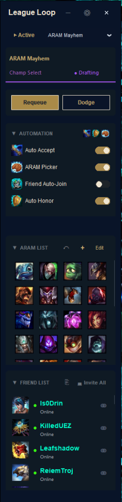
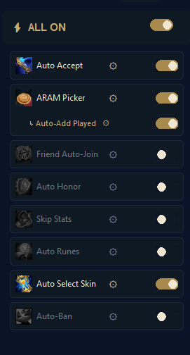



  
  <h1>LeagueLoop</h1>
  
<strong>The Zero-Injection League of Legends Companion for Queue, Draft, Loot, and Session Automation.</strong>

  
  
  

---

## Download

Get the latest standalone setup executable:

👉 [**Download LeagueLoop_Installer.exe**](./LeagueLoop_Installer.exe) *(Version `2-09-261-0317`)*

---

## Visual Showcase

  <table>
    <tr>
      <td align="center" width="25%">
        <strong>Live Companion Dock</strong> 
         
        <em>Queue status & automation controls</em>
      </td>
      <td align="center" width="25%">
        <strong>Dynamic Queue Picker</strong> 
         
        <em>Live modes read directly from LCU</em>
      </td>
      <td align="center" width="25%">
        <strong>Champ Select Assistant</strong> 
         
        <em>ARAM Priority List & Quick Dodge</em>
      </td>
      <td align="center" width="25%">
        <strong>ARAM Top Drawer</strong> 
         
        <em>Bench sniper & Auto-Add Played</em>
      </td>
    </tr>
  </table>

---

## What is LeagueLoop?

**LeagueLoop** is an open-source desktop companion designed to dock seamlessly beside the League of Legends client. It eliminates repetitive friction before and after matches: accepting queues, hovering and locking priority champions, sniping ARAM bench picks, claiming season pass milestones, optimizing network latency, and switching Riot accounts instantly.

### Zero-Injection Safety Invariant
LeagueLoop operates with a strict, non-negotiable architectural boundary:
- **Client-Only Communication**: Interacts exclusively with Riot's official Local Client API (LCU) via local HTTPS REST (`https://127.0.0.1:{port}`) and WebSocket (`wss://`) event subscriptions derived from client lockfiles.
- **Zero Game Memory Tampering**: Never attaches debuggers, reads game memory, hooks DirectX/Vulkan, injects DLLs, or accesses the live match process (`port 2999`).
- **Out-of-Game Scope**: All automation strictly halts when the game begins and resumes only after the victory/defeat screen when the match concludes.

---

## Core Capabilities

### 1. Queue & Matchmaking Automation
- **Auto-Accept Ready Checks**: Instantly accepts queue pops with configurable humanization delays to prevent bot profiling.
- **Dynamic Queue Picker**: Reads available, active, and rotating game modes live from the LCU instead of using outdated static lists.
- **Auto-Requeue**: Automatically restarts matchmaking after a lobby dodge, declined check, or match remake.
- **Friend Auto-Join**: Automatically enters open friend lobbies based on an approved whitelist.

### 2. Champ Select & Draft Assistant
- **ARAM Bench Sniper**: Monitors the team bench and swaps instantly to higher-priority champions the moment teammates drop them.
- **Pre-Populated ARAM Meta Picks**: Fresh installs come pre-populated with the top 10 most played ARAM Mayhem champions (`Jinx`, `Caitlyn`, `Lux`, `Ezreal`, `Yasuo`, `Teemo`, `Aurelion Sol`, `Sett`, `Bel'Veth`, `Hecarim`).
- **Auto-Add Played Champions**: Optional sub-setting in the ARAM List window to automatically record played champions into your priority grid (insert at top or append to bottom).
- **Tier-Ranked Priority Picker**: Selects champions based on custom priority lists with per-role overrides (`Top`, `Jungle`, `Mid`, `Bot`, `Support`).
- **Smart Hover & Lock**: Automatically hovers your preferred pick and locks it in; cascades to backup choices if your pick is banned or taken.
- **Intelligent Auto-Ban**: Automatically bans from your ordered blacklist while respecting teammate hovers to prevent grief-banning.
- **Arena & Randomizer**: Supports Arena synergy pairs and automatically equips random owned skins upon lock-in.

### 3. Season Pass & Loot Engine
- **Season Pass Claimer**: Automatically claims unlocked milestone rewards from Event Hub season passes, Progression Grants, TFT passes, and Ranked Split tracks.
- **Automated Hextech Crafting**: Converts key fragments into completed keys with a single click.
- **Planned Loot Opening**: Bulk opens champion capsules, chests, orbs, and masterwork chests with real-time loot logging.

### 4. Account Switcher & Session Vault
- **Zero-Password Session Swapping**: Restores saved Riot Client sessions (`RiotGamesPrivateSettings.yaml`, `RiotClientPrivateSettings.yaml`, and `Cookies/` SSID tokens) directly to bypass modern hCaptcha challenges.
- **Hardware-Tied DPAPI Security**: Stored credentials are encrypted using Windows Data Protection API (`CryptProtectData`) tied to your Windows user profile.
- **Direct Client Launcher**: Interfaces directly with Riot Client's internal REST API (`/product-launcher/v1/products/league_of_legends/patchlines/live`) to launch the League Client on demand.
- **Wallet & Identity Tracker**: Tracks Blue Essence, RP, level, and Riot ID across all accounts.

### 5. System Optimization & Performance
- **Ping & Latency Optimizer**: Tunes MTU to 1428, applies Cloudflare DNS, and enables TCPNoDelay / registry network optimizations for lower game latency.
- **Safe Process Purger**: Closes background telemetry, updaters, and idle Windows bloatware before entering matches.
- **Diagnostic Action Tracker**: Real-time event logging with paired dual screenshots for diagnostics and debugging.

---

## Companion UI & Magnetic Docking

- **Magnetic Window Docking**: Automatically locks to the League Client window, moves with it, resizes proportionally, and hides when the client is minimized.
- **Compact "Orb" Mode**: One-click toggle into a minimal floating widget to conserve screen real estate.
- **Hextech Modern Theme**: CustomTkinter dark visual language styled with League-inspired hextech gold accents and responsive layouts.

---

## Installation Guide

1. Download [`LeagueLoop_Installer.exe`](./LeagueLoop_Installer.exe).
2. Run the installer (Administrator privileges are recommended for network latency optimization features).
3. Choose your install directory and create a desktop shortcut.
4. Launch LeagueLoop — it will automatically detect your League of Legends client upon startup.

---

## Legal & Disclaimer

LeagueLoop is an unofficial community project. It is not endorsed by, affiliated with, or sponsored by Riot Games, Inc. League of Legends and Riot Games are trademarks or registered trademarks of Riot Games, Inc.
Automating client interactions carries inherent risk under Riot's Terms of Service. This software is provided for personal use under the MIT License.
